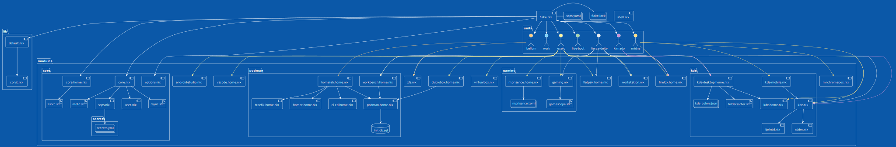

# nix-inventory

Inventaire de mes configurations NixOS personnelles



## Appliquer une configuration

```bash
sudo nixos-rebuild switch --flake github:auroreLeclerc/nix-inventory/#exelo --upgrade-all --impure
```

## Construire une image live-boot

```bash
nix build github:auroreLeclerc/nix-inventory/#nixosConfigurations.live-boot.config.system.build.isoImage
```

### Liste des configurations disponible dans ./units/

| Nom | CPU | Usage |
| --- | --- | ----- |
| bellum | AMD Ryzen 3 4300GE | Serveur |
| exelo | AMD Ryzen 5 7640U | Main |
| fierce-deity | AMD Ryzen 5 3600 | Gaming |
| kimado | AMD Athlon 300U | Old Main |
| midna | Intel Celeron N4020 | Multimédia |
| live-boot | N/A | live-boot |
