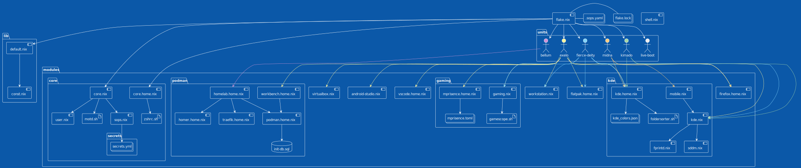

# nix-inventory
Inventaire de mes configurations NixOS personnelles

### Liste des configurations disponible dans ./units/ :
| Nom | CPU | Usage |
| --- | --- | ----- |
| bellum | AMD Ryzen 3 4300GE | Serveur |
| exelo | AMD Ryzen 5 7640U | Main |
| fierce-deity | AMD Ryzen 5 3600 | Gaming |
| kimado | AMD Athlon 300U | Old Main |
| live-boot | N/A | live-boot |



## Appliquer une configuration:
```bash
sudo nixos-rebuild switch --flake .#exelo --upgrade-all --impure
```
## Construire une image live-boot:
```bash
nix build .#nixosConfigurations.live-boot.config.system.build.isoImage
```